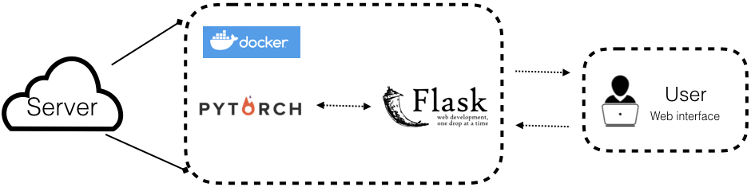
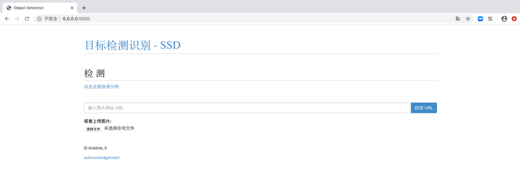
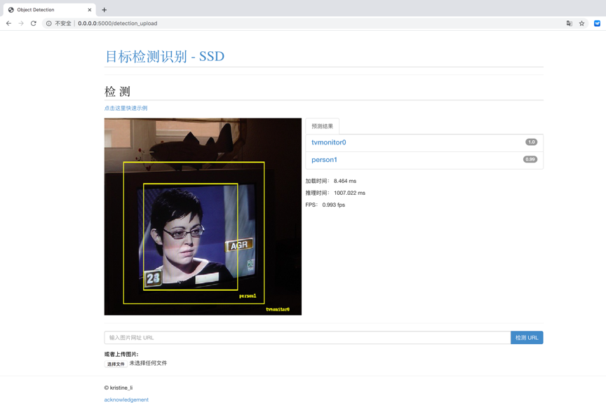

# Deploy Object Detection Model via PyTorch & Flask & Docker
##Introduction

This repository implements [SSD (Single Shot MultiBox Detector)](https://arxiv.org/abs/1512.02325)and deploy it.   The tools needed for this mini-project are:
- A server for inference: Cloud instances or simply your powerful laptop.  
- Data: Pascal VOC or COCO  
- PyTorch: To train the deep learning model.  
- Docker: Make our life easier to create a container for our application.  
- Flask: For API and user interface.  

 


## Highlights
- The environment can be built by **DOCKERFILE** and the service starts by **./serveSSD.sh**.
- **Multi-GPU training and inference**: We use `DistributedDataParallel`, you can train or test with arbitrary GPU(s), the training schema will change accordingly.
- **Modular**: Add your own modules without pain. We abstract `backbone`,`Detector`, `BoxHead`, `BoxPredictor`, etc. You can replace every component with your own code without change the code base. For example, You can add [EfficientNet](https://github.com/lukemelas/EfficientNet-PyTorch) as backbone, just add `efficient_net.py` (ALREADY ADDED) and register it, specific it in the config file, It's done!
- **Smooth and enjoyable training procedure**: we save the state of model, optimizer, scheduler, training iter, you can stop your training and resume training exactly from the save point without change your training `CMD`.
- **Batched inference**: can perform inference using multiple images per batch per GPU.
- **Evaluating during training**: eval you model every `eval_step` to check performance improving or not.
- **Metrics Visualization**: visualize metrics details in tensorboard, like AP, APl, APm and APs for COCO dataset or mAP and 20 categories' AP for VOC dataset.
- **Auto download**: load pre-trained weights from URL and cache it.

## MODEL ZOO
|model        | Password | 
| :--------------: | :----------:| 
|[SSD(efficient_net_b3_ssd300_voc0712)](https://pan.baidu.com/s/18Ouz9LTkMOcxXHsA8fxnpg)|  04mn|
|[SSD(mobilenet_v2_ssd320_voc0712)](https://pan.baidu.com/s/1S4eHnbQXQoDV2SatYl_2DA) |xugv| 
|[SSD(vgg_ssd300_voc0712)]()||


## Preparing Docker image and requirements

```bash
1、Clone the repo 
   git clone https://github.com/kristine-li/SSD-Server.git
   cd SSD-Server

2、build the docker image
   docker build -t ssdServer .

3、run the container
   docker run -i -t -p 5000:5000 ssdServer:latest
   Note：This will run the application on 0.0.0.0:5000, only support for CPU
   TODO: support for GPU： nvidia-docker run -i -t -p 5000:5000 ssdServer:latest

```
Note：In this demo, before step 2，you should download model [SSD(vgg_ssd300_voc0712)]() to model/
## Deploy Object Detection Model
```
1、start 
   ./serveSSD.sh start
```
 
```
2、stop
  ./serveSSD.sh stop
```
## Usage
```
Upload an image via URL or manually
```
 


## Object Detection Model(without using docker)
### Step-by-step installation
```
pip3 install -i https://pypi.tuna.tsinghua.edu.cn/simple  -r requirements.txt
```

### Setting Up Datasets
#### Pascal VOC

For Pascal VOC dataset, make the folder structure like this:
```
VOC_ROOT
|__ VOC2007
    |_ JPEGImages
    |_ Annotations
    |_ ImageSets
    |_ SegmentationClass
|__ VOC2012
    |_ JPEGImages
    |_ Annotations
    |_ ImageSets
    |_ SegmentationClass
|__ ...
```
Where `VOC_ROOT` default is `datasets` folder in current project, you can create symlinks to `datasets` or `export VOC_ROOT="/path/to/voc_root"`.

#### COCO
```
If you train coco dataset, must install cocoapi.
cd ~/github
git clone https://github.com/cocodataset/cocoapi.git
cd cocoapi/PythonAPI
python setup.py build_ext install
```

For COCO dataset, make the folder structure like this:
```
COCO_ROOT
|__ annotations
    |_ instances_valminusminival2014.json
    |_ instances_minival2014.json
    |_ instances_train2014.json
    |_ instances_val2014.json
    |_ ...
|__ train2014
    |_ <im-1-name>.jpg
    |_ ...
    |_ <im-N-name>.jpg
|__ val2014
    |_ <im-1-name>.jpg
    |_ ...
    |_ <im-N-name>.jpg
|__ ...
```
Where `COCO_ROOT` default is `datasets` folder in current project, you can create symlinks to `datasets` or `export COCO_ROOT="/path/to/coco_root"`.

### Single GPU training

```bash
# for example, train SSD300:
python train.py --config-file configs/vgg_ssd300_voc0712.yaml
```
### Multi-GPU training

```bash
# for example, train SSD300 with 4 GPUs:
export NGPUS=4
python -m torch.distributed.launch --nproc_per_node=$NGPUS train.py --config-file configs/vgg_ssd300_voc0712.yaml SOLVER.WARMUP_FACTOR 0.03333 SOLVER.WARMUP_ITERS 1000
```
The configuration files that I provide assume that we are running on single GPU. When changing number of GPUs, hyper-parameter (lr, max_iter, ...) will also changed according to this paper: [Accurate, Large Minibatch SGD: Training ImageNet in 1 Hour](https://arxiv.org/abs/1706.02677).

## Evaluate

### Single GPU evaluating

```bash
# for example, evaluate SSD300:
python test.py --config-file configs/vgg_ssd300_voc0712.yaml
```

### Multi-GPU evaluating

```bash
# for example, evaluate SSD300 with 4 GPUs:
export NGPUS=4
python -m torch.distributed.launch --nproc_per_node=$NGPUS test.py --config-file configs/vgg_ssd300_voc0712.yaml
```

## A simple inference example

Predicting image in a folder is simple:
```bash
python demo.py --config-file configs/vgg_ssd300_voc0712.yaml --images_dir demo --ckpt model/vgg_ssd300_voc0712.pth
```
Then it will download and cache `vgg_ssd300_voc0712.pth` automatically and predicted images with boxes, scores and label names will saved to `demo/result` folder by default.

## Results
### PASCAL VOC:

| Backbone         | Input Size  |          mAP                     | Model Size | 
| :--------------: | :----------:|   :--------------------------:   | :--------: | 
|  VGG16           |     300     |          78.08                   |   210.3MB  |
|  Mobilenet V2    |     320     |          68.40                   |    26.8MB  | 
|  EfficientNet-B3 |     300     |          73.93                   |   101.8MB  | 

## Develop Guide

If you want to add your custom components, please see [DEVELOP_GUIDE.md](DEVELOP_GUIDE.md) for more details.


## Troubleshooting
If you have issues running or compiling this code, we have compiled a list of common issues in [TROUBLESHOOTING.md](TROUBLESHOOTING.md). If your issue is not present there, please feel free to open a new issue.

## Acknowledgement
The implementation is heavily influenced by the projects [SSD](https://github.com/lufficc/SSD),and [ML-web-app](https://github.com/imadelh/ML-web-app#running-on-localcloud-machine). 